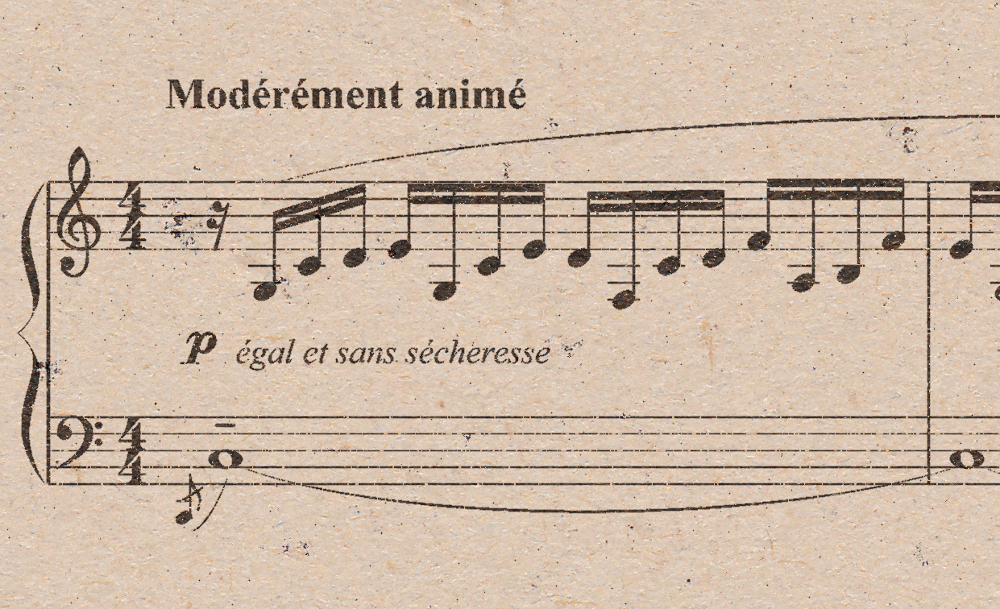

# OMR Synthesis Project

> **WARNING:** This project is still under construction and serves only as a 
place for prototyping image synthesis ideas.

## Overview
The idea behind this project is to automatically generate realistic images of 
music sheets that could serve as a part of data augmentation for learning 
of OMR algorithms. The term "realistic" here refers to "plausibly looking", 
i.e. we do **not** try to **accurately simulate physical phenomena** such as 
paper microstructure or ink diffusion. Rather, we target to use **procedural 
modeling** to achieve realistic results. There are no rules how the parameters
should be set up, simply tune them on a small excerpt to see which combination
matches your expectations.


## Basic Usage
Current version requires binary image of a music score and a sample of
background texture as input. For description and list of parameters please
see help of the particular scripts.

### Background Generation
```bash
python main_generate_background.py --input ./imgs/samples/lq02.png --width 1241 --height 756 --output ./imgs/examples/background.png

```

### Printed Sheet Synthesis
```bash
python main_synthesize_sheet.py --sheet ./imgs/debussy.png --background ./imgs/examples/background.png --output ./imgs/examples/synthesized.png --level 0.6 --blur 1 --leak 0.95 --density 0.3 --outline 0.3 --darkness 1.4

```



 


 


